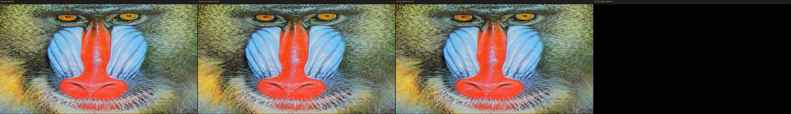

# mjpegZero — FPGA Hardware JPEG Encoder

[](https://github.com/lcapossio/mjpegZero/actions/workflows/ci.yml)
[](LICENSE)
[](rtl/)
[](mjpegzero.core)

**Author:** Leonardo Capossio — [bard0 design](https://www.bard0.com) <hello@bard0.com>

Synthesizable MJPEG encoder written in behavioral Verilog 2001 with AXI interfaces, up to 1080p30 on low end AMD/Xilinx 7-Series FPGAs. Two operating modes: **Full** encodes with runtime quality control;
**Lite** encodes with ~47% smaller LUT footprint and fixed synthesis-time quality.

A Python reference encoder is included for validation and test vector generation.

## Architecture

```
                  +----------------------------------------------------------+
                  |                  mjpegzero_enc_top                        |
                  |                                                          |
  AXI4-Stream  -->| Input    --> 2D  --> Quant --> Zigzag --> Huffman -->     |
  16-bit YUYV     | Buffer      DCT     izer      Reorder    Encoder         |
                  |                                                          |
                  |    --> Bitstream --> JFIF    -->  AXI4-Stream 8-bit JPEG  |
                  |       Packer        Writer                               |
                  |                                                          |
  AXI4-Lite    <->| Register File (ctrl, status, quality, frame count)       |
                  +----------------------------------------------------------+
```

## Interfaces

### Video Input — AXI4-Stream Slave (16-bit)

| Signal               | Width | Direction | Description                        |
|----------------------|-------|-----------|------------------------------------|
| `s_axis_vid_tdata`   | 16    | In        | YUYV packed: `{Cb/Cr[15:8], Y[7:0]}` |
| `s_axis_vid_tvalid`  | 1     | In        | Data valid                         |
| `s_axis_vid_tready`  | 1     | Out       | Backpressure                       |
| `s_axis_vid_tlast`   | 1     | In        | End of scanline                    |
| `s_axis_vid_tuser`   | 1     | In        | Start of frame (first pixel)       |

Even-indexed words carry `{Cb, Y}`, odd-indexed words carry `{Cr, Y}`.
One word per pixel; width × height words per frame (e.g., 1920×1080 or 1280×720).

### JPEG Output — AXI4-Stream Master (8-bit)

| Signal               | Width | Direction | Description                  |
|----------------------|-------|-----------|------------------------------|
| `m_axis_jpg_tdata`   | 8     | Out       | JPEG byte                    |
| `m_axis_jpg_tvalid`  | 1     | Out       | Byte valid                   |
| `m_axis_jpg_tlast`   | 1     | Out       | End of JPEG frame            |

Output is a complete JFIF file (SOI through EOI) per frame.
Byte stuffing (0xFF → 0xFF 0x00) is handled internally.

**No backpressure.** The output has no `tready` signal — the consumer must always
accept data when `tvalid` is asserted. This is safe because compression reduces
the data rate well below the input rate. If the downstream sink may stall
(e.g., shared DMA bus), place a small FIFO (256–512 bytes) between the encoder
output and the sink.

### Control — AXI4-Lite Slave (32-bit)

| Offset | Name       | Access | Description                            |
|--------|------------|--------|----------------------------------------|
| 0x00   | CTRL       | R/W    | `[0]` enable, `[1]` soft_reset        |
| 0x04   | STATUS     | R/W1C  | `[0]` busy, `[1]` frame_done          |
| 0x08   | FRAME_CNT  | RO     | Completed frame count                  |
| 0x0C   | QUALITY    | R/W    | JPEG quality factor (1–100, default 95)|
| 0x10   | RESTART    | R/W    | Restart interval in MCUs (0 = disabled)|
| 0x14   | FRAME_SIZE | RO     | Byte count of last completed frame     |

## Parameters

| Parameter      | Default | Description                                                     |
|----------------|---------|-----------------------------------------------------------------|
| `LITE_MODE`    | 1       | 0 = full (1080p30, runtime quality), 1 = lite (720p60)         |
| `LITE_QUALITY` | 95      | Synthesis-time quality 1–100, used when LITE_MODE=1            |
| `IMG_WIDTH`    | 1280    | Input image width in pixels (multiple of 16)                   |
| `IMG_HEIGHT`   | 720     | Input image height in pixels (multiple of 8)                   |

## Capabilities

- **Standard**: Baseline JPEG (ITU-T T.81), JFIF 1.01 container
- **Chroma**: YUV 4:2:2 (H=2, V=1 subsampling)
- **Tables**: Standard Huffman tables (Annex K), standard quantization tables
- **Quality**: Runtime via AXI4-Lite register (1–100) in full mode; synthesis-time via `LITE_QUALITY` (1–100, default 95) in lite mode
- **Resolution**: Parameterizable; validated at 1920×1080, 1280×720, and 640×480
- **Frame rate**: 1080p30 (full mode), 720p60 (lite mode), both at 150 MHz
- **Output**: Complete JFIF files with SOI, APP0, DQT, SOF0, DHT, SOS, DRI/RST, EOI

## Performance

Both modes run at 150 MHz, delivering 2,343,750 blocks/sec with ~1 MCU row latency (8 lines).

| Metric              | Full Mode                  | Lite Mode                       |
|---------------------|----------------------------|---------------------------------|
| Use case            | HD capture, quality tuning | Cost-sensitive streaming        |
| Target resolution   | 1920×1080 (1080p30)        | 1280×720 (720p60)               |
| Quality             | Runtime adjustable (1–100) | Synthesis-time (1–100, Q95 default) |
| Pipeline headroom   | 1080p30: 83%               | 720p60: 74%                     |

### Compression (Mandrill test image)

| Image    | Quality | Uncompressed (RGB) | JPEG Output | Ratio  | Bits/pixel | PSNR vs original |
|----------|---------|--------------------|-------------|--------|------------|------------------|
| 512×512  | Q95     | 768 KB             | 211 KB      |  3.6:1 | 5.29       | 42.38 dB¹        |
| 1280×720 | Q95     | 2,700 KB           | 569 KB      |  4.7:1 | 4.93       | 37.77 dB         |
| 1280×720 | Q75     | 2,700 KB           | 230 KB      | 11.8:1 | 2.04       | 38.45 dB         |

¹ 42.38 dB is the coefficient-level PSNR of the RTL output vs the Python reference (measures
how closely the RTL matches the reference encoder, not the original image).

**Hardware verification — Mandrill 1280×720, Q75** (Original | HW output | RTL sim | Diff×8):



HW and RTL simulation outputs are byte-exact (PSNR = ∞ dB, Y-PSNR 49.56 dB vs original).

## Resource Usage

### Arty A7-100T Example Project (XC7A100T, post place-and-route, 150 MHz)

The example project includes the encoder core, a JTAG-to-AXI master (for host control),
and a 65,536-word JPEG output buffer. Resources are split accordingly:

| Component             | LUTs  | FFs   | BRAM36 | DSP48 |
|-----------------------|-------|-------|--------|-------|
| Encoder core (Lite)   | ~3,100| ~4,500|  11    |  17   |
| JPEG output buffer    | —     | —     |  64    |  —    |
| JTAG-to-AXI IP        | ~300  | ~200  |   2    |  —    |
| **Demo total**        | **3,413** | **4,720** | **77** | **21** |

**WNS = +0.275 ns — timing closed at 150 MHz.**
Utilization: 5.4% LUTs, 3.7% FFs, 57% BRAM36 (driven by the 64-BRAM output FIFO; encoder itself uses 11).

### Encoder Core Only (7-Series -1, post place-and-route, 150 MHz)

| Resource   | Full Mode (1080p) | Lite Mode (720p) |
|------------|-------------------|------------------|
| LUTs       | 4,559             | 4,311 (synth)    |
| Flip-Flops | 3,227             | 8,697 (synth)    |
| BRAM36     | 16                | 11               |
| DSP48E1    | 23                | 17               |
| WNS        | +0.072 ns         | +0.057 ns (S7-50)|

Full mode BRAM breakdown: Y=8, Cb=4, Cr=4 = 16 tiles (1080p line buffer).
Lite mode BRAM breakdown: Y=5, Cb=3, Cr=3 = 11 tiles (720p line buffer). Core pipeline uses zero BRAM.

## Pipeline Modules

| Module              | File                         | Description                                               |
|---------------------|------------------------------|-----------------------------------------------------------|
| Input Buffer        | `rtl/input_buffer.v`         | YUYV de-interleave, 8-line BRAM buffer, MCU-order output  |
| 1D DCT              | `rtl/dct_1d.v`               | 8-point forward DCT, matrix multiply with 13-bit cosine ROM |
| 2D DCT              | `rtl/dct_2d.v`               | Row-column decomposition with transpose buffer            |
| Quantizer           | `rtl/quantizer.v`            | Multiply-by-reciprocal, 4-stage pipeline                  |
| Zigzag Reorder      | `rtl/zigzag_reorder.v`       | ROM-based address remap, double-buffered                  |
| Huffman Encoder     | `rtl/huffman_encoder.v`      | Multi-cycle FSM, full DC/AC standard tables               |
| Bitstream Packer    | `rtl/bitstream_packer.v`     | 64-bit accumulator, byte stuffing                         |
| JFIF Writer         | `rtl/jfif_writer.v`          | 623-byte header ROM, SOI/markers/EOI state machine        |
| AXI4-Lite Regs      | `rtl/axi4_lite_regs.v`       | Control/status register file                              |
| SDP BRAM            | `rtl/bram_sdp.v`             | Behavioural wrapper; vendor-specific primitives in `rtl/vendor/` |
| Top-Level           | `rtl/mjpegzero_enc_top.v`    | Pipeline integration and frame control                    |
| Timing Wrapper      | `rtl/synth_timing_wrapper.v` | I/O flip-flops for synthesis timing analysis              |

All pipeline modules are written in behavioural Verilog 2001. The only vendor-specific
file is `rtl/bram_sdp.v`, which instantiates the AMD `RAMB36E1` primitive. Equivalents
for other vendors are provided as stubs under `rtl/vendor/` and are drop-in replacements.

## Quick Start

### Prerequisites

- AMD/Xilinx Vivado 2020.2+ (tested with 2025.2)
- Python 3.8+ with NumPy, SciPy, Pillow (for reference encoder)
- FFmpeg (for validation)

### Verification

The verification suite is split into three tiers. The first two tiers require
only Python and iverilog — they are what GitHub Actions CI runs on every push.
The third tier requires Vivado and is for local full-frame validation.

#### Tier 1 — Python-only (no simulator, no Vivado)

```bash
# Huffman ROM tables match ITU-T T.81 Annex K
python python/verify_huffman_rom.py

# LITE_QUALITY quantisation & reciprocal tables match Python reference
python python/verify_lite_quality.py

# Python reference encoder: encode 720p mandrill, decode, report PSNR
python python/test_encoder.py

# Visual quality check: side-by-side Original | JPEG decoded | Difference×8
python python/mandrill_compare.py --quality 95
python python/mandrill_compare.py --quality 75 --out compare_q75.png
```

#### Tier 2 — RTL simulation with iverilog  ← CI path

Compiles all RTL with iverilog, runs the CI testbench, and compares output
JPEG coefficients block-by-block against Python reference files for Q=50, 75, 95.
Pass criterion: max coefficient difference ≤ 1 (fixed-point rounding tolerance).

```bash
# Full mode (LITE_MODE=0, runtime quality via AXI4-Lite)
python python/verify_rtl_sim.py

# Lite mode (LITE_MODE=1, synthesis-time quality tables)
python python/verify_rtl_sim.py --lite

# With VCD dump
python python/verify_rtl_sim.py --dump-vcd

# Optionally simulate with the real Xilinx RAMB36E1 primitive (requires Vivado)
python python/verify_rtl_sim.py --unisims auto
```

Requires: `iverilog` / `vvp` on PATH, Python ≥ 3.8 with NumPy.
Without `--unisims`, a portable behavioural BRAM model is used (default, CI path).

#### Tier 3 — Full 720p Vivado simulation  (local only, requires Vivado)

```bash
python scripts/run_sim.py 720p           # no waveforms
python scripts/run_sim.py 720p vcd       # + VCD dump → build/sim/tb_mjpegzero_enc.vcd
python scripts/run_sim.py lite vcd       # lite mode with VCD
```

Output JPEG is written to `build/sim/sim_output.jpg`. Verified PSNR vs original: **37.77 dB**.

### FuseSoC

The core is described in [`mjpegzero.core`](mjpegzero.core) (CAPI2 format).

```bash
# Add core to local library
fusesoc library add mjpegzero .

# Run simulation (icarus, full mode)
fusesoc run --target sim bard0-design:mjpegzero:mjpegzero_enc

# Run simulation (lite mode)
fusesoc run --target sim_lite bard0-design:mjpegzero:mjpegzero_enc

# Lint with Verilator
fusesoc run --target lint bard0-design:mjpegzero:mjpegzero_enc

# Synthesize for AMD/Xilinx Arty A7-100T
fusesoc run --target synth_amd bard0-design:mjpegzero:mjpegzero_enc

# Override parameters
fusesoc run --target sim bard0-design:mjpegzero:mjpegzero_enc \
  --LITE_MODE 0 --IMG_WIDTH 1920 --IMG_HEIGHT 1080
```

Available targets: `sim`, `sim_lite`, `lint`, `synth_amd`, `synth_amd_lite`.

To use mjpegZero as a dependency in your own FuseSoC project, add to your `.core` file:
```yaml
depend:
  - bard0-design:mjpegzero:mjpegzero_enc:0.1.0
```

### Run Synthesis

```bash
# Using the master runner (recommended):
python scripts/run_all.py synth               # Full mode, AMD/Xilinx (default)
python scripts/run_all.py synth --vendor amd
python scripts/run_all.py impl  --vendor amd

# Direct Vivado invocation:
# Full mode (1920×1080, 150 MHz, runtime quality)
vivado -mode batch -source scripts/synth/amd/run_synth.tcl

# Lite mode (1280×720, 150 MHz, default Q95)
vivado -mode batch -source scripts/synth/amd/run_synth.tcl -tclargs lite

# Lite mode with custom quality (e.g., Q80)
vivado -mode batch -source scripts/synth/amd/run_synth.tcl -tclargs lite 80
```

Reports are written to `build/synth/` or `build/synth_lite/`.

**Only AMD/Vivado is fully implemented.** Synthesis scripts for other vendors
(Altera, Lattice, Microchip, Efinix, GoWin) are scaffolded in
`scripts/synth/<vendor>/` — implement the tool-specific Tcl flow and
replace `rtl/bram_sdp.v` with the matching `rtl/vendor/<vendor>/bram_sdp.v`.
Contributions welcome — see [CONTRIBUTING.md](CONTRIBUTING.md).

### Run Implementation (Place & Route)

```bash
python scripts/run_all.py impl
```

Reports are written to `build/impl/`.

### Utility Scripts

| Script | Purpose |
|--------|---------|
| `python/mandrill_compare.py` | Encode/decode the mandrill image and produce a side-by-side PNG: Original \| JPEG decoded \| Difference×8. |
| `python/compare_jpeg_scan.py` | Block-by-block DCT coefficient comparison between two JPEG files. |
| `python/gen_huffman_rom.py` | Regenerate the Huffman ROM `initial` block in `rtl/huffman_encoder.v` from the standard BITS/VALS arrays. |
| `python/gen_lite_tables.py` | Regenerate the LITE_QUALITY quantisation table `initial` blocks in `rtl/quantizer.v`. |
| `python/yuyv_convert.py` | Shared RGB-to-YUYV conversion for RTL simulation and hardware tests. |
| `scripts/hw_test_mandrill.py` | End-to-end hardware verification: converts mandrill 720p, runs RTL sim + HW encode, compares outputs. |
| `scripts/hw_test_a7.tcl` | Vivado batch script to program A7-100T and encode a YUYV file via JTAG-to-AXI. |

## Integration Example

```verilog
mjpegzero_enc_top #(
    .IMG_WIDTH    (1920),
    .IMG_HEIGHT   (1080),
    .LITE_MODE    (0),         // 1 = fixed quality, 720p, ~47% fewer LUTs
    .LITE_QUALITY (95)         // Synthesis-time quality (1-100), lite mode only
) u_mjpeg (
    .clk               (pixel_clk),        // 150 MHz
    .rst_n             (sys_rst_n),

    // Connect to video source (camera, framebuffer, etc.)
    .s_axis_vid_tdata  (video_tdata),       // 16-bit YUYV
    .s_axis_vid_tvalid (video_tvalid),
    .s_axis_vid_tready (video_tready),
    .s_axis_vid_tlast  (video_tlast),       // End of line
    .s_axis_vid_tuser  (video_tuser),       // Start of frame

    // Connect to DMA or output FIFO (no backpressure — always accept)
    .m_axis_jpg_tdata  (jpeg_tdata),        // 8-bit JPEG bytes
    .m_axis_jpg_tvalid (jpeg_tvalid),
    .m_axis_jpg_tlast  (jpeg_tlast),        // End of JPEG frame

    // Connect to AXI interconnect or tie off
    .s_axi_awaddr      (axi_awaddr),
    .s_axi_awvalid     (axi_awvalid),
    .s_axi_awready     (axi_awready),
    .s_axi_wdata       (axi_wdata),
    .s_axi_wstrb       (axi_wstrb),
    .s_axi_wvalid      (axi_wvalid),
    .s_axi_wready      (axi_wready),
    .s_axi_bresp       (axi_bresp),
    .s_axi_bvalid      (axi_bvalid),
    .s_axi_bready      (axi_bready),
    .s_axi_araddr      (axi_araddr),
    .s_axi_arvalid     (axi_arvalid),
    .s_axi_arready     (axi_arready),
    .s_axi_rdata       (axi_rdata),
    .s_axi_rresp       (axi_rresp),
    .s_axi_rvalid      (axi_rvalid),
    .s_axi_rready      (axi_rready)
);
```

## Tested Hardware

| Board | Part | Example project | Status |
|-------|------|-----------------|--------|
| Digilent Arty A7-100T | XC7A100TCSG324-1 | [`example_proj/arty_a7_100t/`](example_proj/arty_a7_100t/) | HW verified |

Any AMD/Xilinx 7-Series device is a straightforward port — swap the XDC and adjust `JPEG_WORDS`
for available BRAM. Vendor BRAM wrappers for Altera, Lattice, Microchip, Efinix, and Gowin are
provided as stubs in `rtl/vendor/`.

## Applications

- **Drone / UAV cameras** — lightweight MJPEG stream over a low-bandwidth radio link
- **IP security cameras** — per-frame JPEG over Ethernet, no inter-frame dependency
- **Machine vision** — on-FPGA compression before USB/GigE transfer to host
- **Medical imaging** — lossless-adjacent quality (Q95+) with intra-frame-only coding
- **Automotive** — dashcam and surround-view recording with frame-accurate random access
- **Industrial inspection** — compress high-speed line-scan data in real time
- **Broadcast contribution** — MJPEG-over-RTP for low-latency studio feeds
- **Frame grabbers** — capture and compress SDI/HDMI input on an FPGA capture card

## Directory Structure

```
mjpegZero/
  rtl/              Synthesizable Verilog 2001 source
    vendor/         Board-specific BRAM wrappers (AMD, Altera, Lattice, …)
  sim/              SystemVerilog testbench and test vectors
  python/           Reference encoder, verification, test vector generation
  scripts/          Vivado TCL scripts and Python runner
  example_proj/     Ready-to-build board examples
    arty_a7_100t/   Digilent Arty A7-100T (HW verified)
  build/            Synthesis/implementation output (generated)
```

## Contributing

Contributions are welcome. See [CONTRIBUTING.md](CONTRIBUTING.md) for details.

The most impactful contributions are **board-level examples** that show the encoder
running on hardware beyond the reference Arty A7-100T. All examples live under
[`example_proj/<board_name>/`](example_proj/). New examples for Nexys Video,
ZedBoard, DE10-Nano, iCEBreaker, and others are welcome.

## License

Apache License 2.0 + Commons Clause v1.0. See [LICENSE](LICENSE) for full terms.

**Non-commercial use** (research, education, hobby projects, open-source) is
freely permitted under the Apache 2.0 terms.

**Commercial use** (integration into commercial products, services, or
consulting engagements) requires written permission from the author.
Contact: hello@bard0.com
